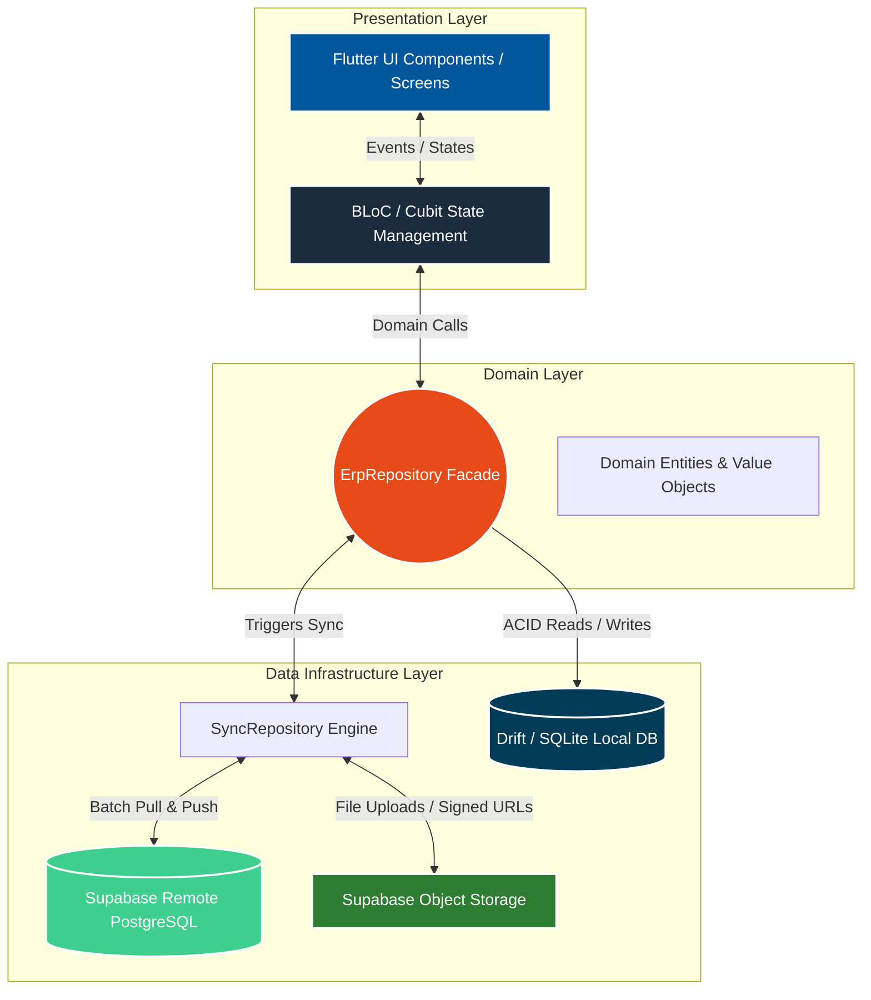

# 🏢 SakanOS | Enterprise Real Estate Resource Planning (ERP) System

[](#)
[](#)
[](#)
[](#)
[](#)
[](#)

---

## 📑 Executive Summary

Real estate developers, general contracting firms, and housing cooperatives operating in high-volatility markets face severe macroeconomic and operational bottlenecks: currency devaluation, material price hyperinflation, unstable connectivity, and error-prone manual spreadsheets.

**SakanOS** is an offline-first, enterprise-grade ERP system built with Flutter and Dart. Designed with a clean architecture and a centralized repository facade, SakanOS digitizes the entire property lifecycle—from architectural cataloging and inventory allocation to inflation-hedged financial contracts, automated overdue monitoring, legal archiving, and dual-copy audit receipts.

The system provides a **100% operational guarantee during network outages** via local SQLite transactions (`Drift`), seamlessly orchestrating background bidirectional synchronization with a remote `Supabase` (PostgreSQL) backend when connectivity is available.

---

## 📈 Operational Impact: Legacy Process vs. SakanOS

| Operational Workflow                   | Traditional Manual / Excel Method          | SakanOS ERP Automated Engine                                  | Quantitative Impact                  |
| :------------------------------------- | :----------------------------------------- | :------------------------------------------------------------ | :----------------------------------- |
| **Contract Pricing & Signing**   | ~45 minutes of manual estimation           | **< 15 seconds** (Instant algorithmic calculation)      | **99% time reduction**         |
| **Network Outage Resilience**    | Operations halt completely                 | **100% local operation** with offline-first storage     | **Zero operational downtime**  |
| **Inflation & Currency Risk**    | Fixed installments lose value to inflation | **Dynamic material-pegged pricing** & converted $m^2$ | **Eliminates capital erosion** |
| **Overdue & Delay Penalties**    | Subject to oversight & human manipulation  | **Automated time-pegged penalties** & tracking radar    | **Zero revenue leakage**       |
| **Audit & Accounting Integrity** | Manual editing / unrecorded cancellations  | **Strict 5-minute grace period** & reverse entries      | **100% GAAP compliance**       |
| **Receipt & Statement Delivery** | Manual document drafting & printing        | **Automated dual-copy PDF** & 1-click WhatsApp bridge   | **Immediate delivery**         |

---

## 🏗️ Architectural Blueprint & Clean Data Flow

SakanOS follows **Clean Architecture** and the **Facade Pattern**, decoupling presentation, business logic, persistence, and external synchronization.



### Architectural Highlights

1. **Deterministic UUID v7 Keys:** Every local transaction generates a time-ordered UUID v7 primary key, eliminating ID collisions during multi-device synchronization.
2. **Chunked Pull Synchronization (`_fetchAllPaginated`):** Bypasses API payload limits by fetching data in paginated batches of 1,000 records, filtering by UTC timestamps (`updated_at`) to optimize network throughput.
3. **Atomic Multi-Entity Transactions:** Compound operations (such as contract signing, inventory status locking, installment schedule generation, and down-payment entry creation) execute within unified SQLite `transaction()` blocks to prevent orphaned records.
4. **Real-time Pricing Broadcasts:** Supabase Realtime PostgreSQL channels push live material and currency updates across all active client workstations.

---

## 🧮 The Core Mathematical & Financial Engine

```
                               ┌────────────────────────────────────────────────────────┐
                               │                 RAW BASE COST (per m²)                 │
                               │  Iron (30kg) + Cement (4 bags) + Blocks (50 pcs)       │
                               │  + Formwork (1m³) + Aggregates (2m³) + Labor (1 day)   │
                               └───────────────────────────┬────────────────────────────┘
                                                           │
                                                           ▼
                               ┌────────────────────────────────────────────────────────┐
                               │               LOCATION COEFFICIENT (L)                 │
                               │          Base Cost + (Base Cost × Location %)          │
                               └───────────────────────────┬────────────────────────────┘
                                                           │
                                                           ▼
                               ┌────────────────────────────────────────────────────────┐
                               │               SPATIAL COEFFICIENTS (Σ C_i)             │
                               │     Direction + Floor + Frontage + Elevator + Profit   │
                               └───────────────────────────┬────────────────────────────┘
                                                           │
                                                           ▼
                               ┌────────────────────────────────────────────────────────┐
                               │               FINAL PRICE PER METER (P_m)              │
                               │           Adjusted Cost × (1 + Total Multipliers)      │
                               └───────────────────────────┬────────────────────────────┘
                                                           │
                                                           ▼
                               ┌────────────────────────────────────────────────────────┐
                               │           CONVERTED METERS ASSET ACQUISITION           │
                               │          Meters Acquired = Amount Paid ÷ P_m           │
                               └────────────────────────────────────────────────────────┘
```

### 1. Dynamic Inflation-Hedged Formula

To protect developers and buyers from market volatility, the raw base cost per square meter ($C_{\text{base}}$) is derived from six core construction commodities:

$$
C_{\text{base}} = (30 \cdot P_{\text{iron}}) + (4 \cdot P_{\text{cement}}) + (50 \cdot P_{\text{block15}}) + (1 \cdot W_{\text{formwork}}) + (2 \cdot P_{\text{aggregates}}) + (1 \cdot W_{\text{labor}})
$$

### 2. Spatial & Architectural Coefficient Adjustments

The final price per square meter ($P_{\text{final}}$) applies a tiered coefficient system:

1. **Primary Location Multiplier ($K_{\text{location}}$):** Applied directly to $C_{\text{base}}$.
2. **Secondary Multipliers ($\sum K_i$):** Including floor level, geographic direction, main-street frontage, elevator availability, shared architectural fittings, and developer profit margin.

$$
P_{\text{adjusted}} = C_{\text{base}} \cdot (1 + K_{\text{location}})
$$

$$
P_{\text{final}} = P_{\text{adjusted}} \cdot \left(1 + \sum K_i\right)
$$

### 3. Asset Acquisition via Converted Meters

When a buyer makes an installment payment ($A_{\text{paid}}$), SakanOS converts the payment into acquired square meters ($M_{\text{acquired}}$) at the prevailing rate on the day of payment:

$$
M_{\text{acquired}} = \frac{A_{\text{paid}} \cdot (1 + R_{\text{bonus}})}{P_{\text{final}}}
$$

* **Purchased meters are permanent physical equity:** Once acquired, they are immune to subsequent material price spikes or currency inflation.

---

## 📦 System Modules & Capabilities

```
SakanOS ERP
├── 📊 Executive Dashboard & Analytics
├── 🏢 Real Estate Catalog & Units
├── 📄 Contracts & Portfolio Management
├── 🎯 Intelligent Monitoring Radar
├── 💰 Payments Ledger & Financial Audit
├── ⚖️ Legal Affairs Archive
├── 🗑️ Two-Tier Recycle Bin
├── 🔐 Security, Anti-Tampering & RBAC
└── 🖨️ Document Generation & Communication
```

---

### 1. 📊 Executive Dashboard & Analytics

* **Real-time Executive KPIs:** Net liquidity, refunded capital, active contracts, available inventory units, and debts split into:
  * **Current Debt (Pre-Handover):** Receivables on units under construction (no penalties).
  * **Due Debt (Post-Handover):** Receivables on delivered units (active automated penalties).
* **Interactive Charting Suite (`fl_chart`):**
  * Cash-flow and revenue collection trends by time period (Daily, Weekly, Monthly, Yearly).
  * USD exchange rate history and raw engineering construction cost curves.
  * Portfolio breakdown (Allocated units vs. Unallocated investment shares).
  * Real estate inventory status breakdown (Available, Sold, Delivered).
  * Dedicated 6-commodity trend analysis page (`MaterialsTrendPage`).
* **Live System Audit Log:** Chronological activity stream tracking contract signings, payment entries, legal actions, and administrative adjustments.

---

### 2. 🏢 Real Estate Catalog & Property Inventory

* **Residential & Commercial Properties:** Full support for apartments and commercial shops with specialized engineering metrics (Ground slab area, facade frontage width, terrace ratio, and yard multipliers).
* **Floor Model Cloning:** Duplicates entire floor architectural configurations to target floors with one click, auto-adjusting unit numbering and floor-specific price multipliers.
* **Document & Blueprint Galleries:** Multi-file attachment system (PDFs, high-resolution architectural blueprints, images, Word, and Excel files) stored locally and mirrored to secure cloud storage.

---

### 3. 📄 Contracts & Portfolio Management

* **Dual Contract Modalities:**
  1. **Allocated Contracts:** Directly linked to a specific physical unit in the building catalog with handover dates, grace periods, and delay penalty terms.
  2. **Unallocated Portfolios:** Investment shares where payments accumulate inflation-protected meters for future property selection.
* **Historical Back-Dating Support:** Ability to back-date older agreements with historical material and currency exchange rates for retroactive ledger calculation.
* **Contract Archiving & Completion:** Closes and locks completed contracts to prevent unauthorized modifications while preserving the full audit trail.

---

### 4. 🎯 Intelligent Monitoring Radar

* **Overdue Radar:** Categorizes payment defaults by severity based on days past due:
  * 🟢 **Notice:** < 30 days overdue.
  * 🟠 **Warning:** 30–59 days overdue.
  * 🔴 **Critical:** 60+ days overdue.
* **Allocation Proximity Radar:** Monitors investment velocity ($m^2/\text{month}$) for unallocated portfolios, forecasting months remaining until unit selection threshold is reached.
* **Administrative Action Memory:** Logs client interactions (e.g., promises to pay) to temporarily defer alerts and keep operational queues focused.

---

### 5. 💰 Payments Ledger & Financial Audit

* **Multi-Currency Support:** Handles payments in local currency (SYP) or US Dollars (USD) with automated conversion at the transaction date's exchange rate.
* **Bonus & Discount Handling:** Tracks client incentives or penalty deductions with automatic adjustments to acquired square meters.
* **GAAP-Compliant Audit Trail:**
  * **5-Minute Grace Period:** Allows direct cancellation and voiding of erroneous receipts within 5 minutes of creation.
  * **Reverse Entry Enforcement:** After 5 minutes, records lock permanently, requiring an automated negative refund voucher to reverse the entry without altering audit history.

---

### 6. ⚖️ Legal Affairs Archive

* **Judicial Action Tracking:** Complete registry for formal notices, property transfers, mortgages, settlements, and active lawsuits.
* **Secure Evidence Vault:** Attach court records, official summons, and legal deeds with automatic cloud backup and time-limited signed URL generation.

---

### 7. 🗑️ Two-Tier Global Recycle Bin

* **Cascading Soft Deletion:** Deleting a client or building cascades down to associated contracts, units, schedules, and attachments, preserving referential integrity.
* **7-Day Automated Purge (TTL):** Automatically purges soft-deleted records after 7 days using cryptographically verified system time.
* **PIN-Protected Hard Destruction:** Permanent database deletion requires administrator security PIN authorization.

---

### 8. 🔐 Security, Anti-Tampering & RBAC

* **Granular Role-Based Access Control:** Configurable JSON permission sets across 5 core functional groups (Clients, Contracts, Finance, Legal, System).
* **SecureTime™ Clock Anti-Tamper Engine:**
  * Queries trusted external server headers (`HTTP Date`) to compute true network drift.
  * Encrypts time drift tokens locally using XOR base64 encryption.
  * Detects and blocks local OS clock rollback attempts.
  * Enforces an offline lockout if disconnected for more than 7 consecutive days.
* **5-Minute Sensitive Action Session:** PIN-verified actions grant a temporary 5-minute elevated session with a visual countdown timer in the navigation rail.

---

### 9. 🖨️ Document Generation & Communication

* **Dual-Copy Receipt Generator:** Automatically renders high-resolution, print-ready PDF receipts split into **Office Copy** and **Client Copy**.
* **Bilingual Statements & Pledges:** Generates contractual ledgers, investment portfolio statements, and formal property handover pledges.
* **Arabic Number-to-Words (`ArabicTafqeet`):** Automatically converts numeric monetary values into formal legal Arabic phrasing (*Tafqeet*).
* **Excel Export & WhatsApp Integration:** One-click `.xlsx` workbook generation and direct WhatsApp notification integration with pre-filled receipt details and payment reminders.

---

## 🛠️ Technology Stack

```
Frontend & UI        ──► Flutter 3.41+ / Dart 3.11+ (Windows Desktop, macOS, Android)
State Management     ──► BLoC / Cubit (flutter_bloc 9.1+, equatable 2.0+)
Local Persistence    ──► Drift 2.32+ (SQLite Native Engine, sqlite3_flutter_libs)
Cloud & Sync         ──► Supabase Flutter 2.15+ (PostgreSQL, Row-Level Security, Storage)
Data Analytics       ──► fl_chart 1.2+
PDF & Printing       ──► pdf 3.12+, printing 5.14+
Spreadsheet Engine   ──► excel 4.0+
Internationalization ──► Flutter l10n (Synthetic packages, .arb translation schema)
Security & Secrets   ──► envied 1.3+ (Build-time secret obfuscation)
```

---

## 📂 Repository Structure

```
.
├── lib/
│   ├── admin/             # RBAC management, role templates, user approvals
│   ├── app/               # Root application widget & routing
│   ├── auth/              # Authentication Cubit, session validation, offline guards
│   ├── buildings/         # Property catalog, buildings, apartments, shops, floor cloning
│   ├── clients/           # Client profiles, directory, search, PIN prompts
│   ├── contracts/         # Contract workflows, dynamic pricing, handover actions
│   ├── core/              # Constants, permissions, math helpers, PDF & WhatsApp utilities
│   ├── dashboard/         # Navigation rail, multi-tab layout, sync status
│   ├── env/               # Obfuscated environment variable definitions
│   ├── home/              # Analytics dashboard, KPI grid, interactive charts
│   ├── l10n/              # Localization files (app_en.arb, app_ar.arb) & Cubit
│   ├── legal/             # Legal action logging, attachment viewers, court records
│   ├── login/             # Authentication screens & credential persistence
│   ├── payments/          # Ledger entries, payment capture, dual-copy receipts
│   ├── profile/           # Comprehensive client & contract portfolio drill-downs
│   ├── recycle_bin/       # Global soft-deleted records manager & restoration
│   ├── register/          # New user registration & metadata dispatch
│   ├── schedule/          # Overdue radar, allocation forecasting, rolling checkpoints
│   ├── settings/          # Price configs, dollar rate records, manual backup/restore
│   └── bootstrap.dart     # System initialization, global error boundaries & observer
│
└── packages/
    ├── local_storage_api/ # Drift/SQLite tables, DAOs, migrations, SecureTime engine
    ├── cloud_storage_api/ # Supabase client, storage uploads, signed URL resolvers
    └── erp_repository/    # Unified repository facade orchestrating data & sync
```

---

## 🚀 Getting Started

### Prerequisites

* [Flutter SDK](https://docs.flutter.dev/get-started/install) (v3.41.0 or higher)
* [Dart SDK](https://dart.dev/get-dart) (v3.11.0 or higher)
* A [Supabase](https://supabase.com/) Project with PostgreSQL schema and Storage buckets configured.

---

### 1. Clone the Repository

```bash
git clone https://github.com/your-org/sakanos-erp.git
cd sakanos-erp
```

---

### 2. Configure Environment Variables

Create a `.env` file in the project root:

```env
SUPABASE_URL=https://your-project-id.supabase.co
SUPABASE_ANON_KEY=your-supabase-anon-key-here
```

---

### 3. Install Dependencies & Generate Code

Fetch dependencies and run code generation for `drift` database schemas and `envied` obfuscated secrets:

```bash
# Get dependencies for all workspace packages
flutter pub get
(cd packages/local_storage_api && flutter pub get)
(cd packages/cloud_storage_api && flutter pub get)
(cd packages/erp_repository && flutter pub get)

# Run build runner to generate database and environment files
dart run build_runner build --delete-conflicting-outputs
```

---

### 4. Launch Configurations

SakanOS includes isolated entry points for development, staging, and production:

```bash
# Development Mode
flutter run -t lib/main_development.dart -d windows

# Staging Mode
flutter run -t lib/main_staging.dart -d windows

# Production Mode
flutter run -t lib/main_production.dart -d windows
```

---

## 🛡️ Continuous Integration & Quality Assurance

All pull requests and commits to `main` are validated via the automated GitHub Actions CI workflow:

```bash
# Run static analysis
flutter analyze .

# Check formatting
dart format --output=none --set-exit-if-changed .

# Execute unit and repository tests
flutter test
```

---

<div align="center">
  <b>SakanOS ERP System</b> — Enterprise Real Estate Resource Planning<br>
  <i>Engineered for stability, precision, and performance in volatile markets.</i>
</div>
