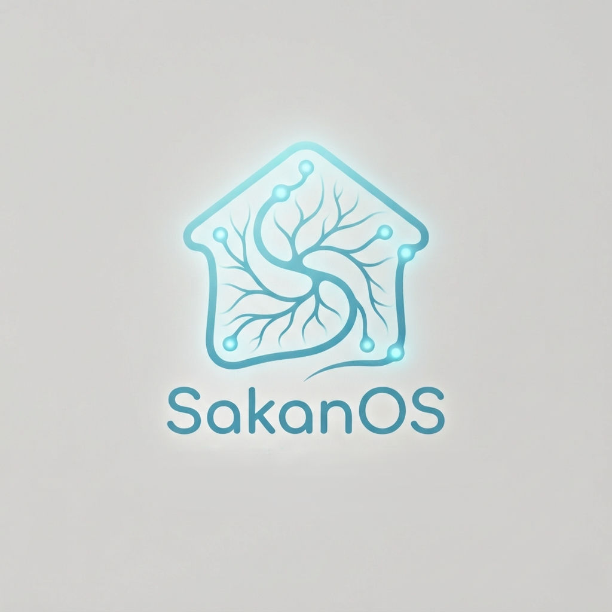
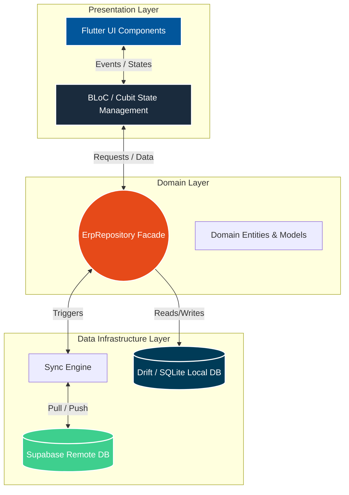

<div align="center">
  
  
  # SakanOS 🏢
  **Enterprise-Grade, Offline-First Real Estate ERP**
  
  [](https://flutter.dev)
  [](https://dart.dev)
  [](https://supabase.com)
  [](https://drift.simonbinder.eu/)
  [](https://bloclibrary.dev/)
</div>

---

## 📑 Executive Summary
Real estate development companies operating in volatile markets face severe operational bottlenecks: unstable internet connectivity, severe currency/material inflation, and complex, error-prone manual installment tracking. 

**SakanOS** is a localized, offline-first Enterprise Resource Planning (ERP) system engineered to solve these exact challenges. Built with Flutter for cross-platform desktop/mobile deployment, SakanOS digitizes the entire real estate lifecycle—from inventory and client management to dynamic, material-pegged financial contracts and legal archiving. The system guarantees **0% downtime** by prioritizing local SQLite reads/writes, silently syncing with a Supabase cloud backend the moment network connectivity is restored.

---

## 📈 Impact Metrics (Manual vs. SakanOS)

| Workflow / Metric | Traditional Manual Process | SakanOS Automated Workflow | Impact |
| :--- | :--- | :--- | :--- |
| **Contract Generation & Pricing** | ~45 minutes (Manual calculation) | **< 15 seconds** (Auto-calculated) | **99% faster** |
| **Offline Reliability** | Standstill during outages | **100% Operational** | **Zero Downtime** |
| **Late Penalty Tracking** | Prone to human error / manipulation | **Fully Automated & Tamper-Proof** | **Zero Revenue Leakage** |
| **Data Synchronization** | Manual data entry at EOD | **Background Bi-Directional Sync** | **Real-time Accuracy** |
| **Ledger / Receipts Output** | Manual Word/Excel typing | **Instant PDF Generation & WhatsApp** | **Instant Delivery** |

---

## 🏗️ Clean Architecture & Data Flow

SakanOS strictly adheres to Clean Architecture principles, utilizing the Repository Pattern as a Facade to abstract data source complexity from the UI/BLoC layers.



---

## 🚀 Engineering Highlights

### 1. Offline-First Bi-Directional Sync Engine
SakanOS is designed to never block the user. All reads and writes occur instantly on the local SQLite database (`Drift`). 
* **Conflict-Free Pushing:** A background `SyncRepository` handles batched upserts to Supabase based on an `is_synced` flag.
* **Paginated Pulling:** To bypass payload limits, the system safely pulls remote data in chunks of 1,000 records (`_fetchAllPaginated`), cross-referencing `updated_at` UTC timestamps to avoid overwriting local changes.
* **Realtime Listeners:** Utilizes Supabase Postgres changes to push live pricing updates across all active nodes automatically.

### 2. SecureTime™ Anti-Tamper Engine
Because contracts involve severe financial delay penalties, client devices cannot be trusted. If an employee alters the OS clock to bypass late fees, SakanOS detects it.
* Pings secure external headers (e.g., `google.com`) to calculate a true `Duration offset`.
* Stores the offset via encrypted XOR base64 locally (`sys_time_drift_offset`).
* Overrides `DateTime.now()` system-wide, ensuring all financial calculations and contract signatures are cryptographically tied to actual network time.

### 3. Atomic ACID Transactions
Financial integrity is paramount. Operations like signing a contract involve multiple database mutations (Creating the Contract, logging the Down Payment, locking the Apartment Inventory, creating the Installment Schedule).
* Utilizing Drift's `transaction()` blocks, SakanOS guarantees **Atomicity**.
* Example: If the initial payment logging fails, the contract creation and inventory locks are instantly rolled back, preventing orphaned data or double-booked real estate units.

### 4. Advanced Role-Based Access Control (RBAC) & Grace Periods
* **Granular Permissions:** JSON-driven custom roles controlling everything from viewing clients to hard-deleting legal archives.
* **Action Grace Periods:** Critical actions (like deleting a payment) have a 5-minute "Developer Grace Period" for soft-deletes. After 5 minutes, records are locked, forcing users to utilize standard **Double-Entry Accounting** (creating a reverse refund entry) to ensure audit compliance.

---

## 🧩 Core Modules

* **🏢 Inventory Catalog:** Manage Buildings, Apartments, and Commercial Shops with complex architectural pricing coefficients (Floor, Direction, Facades).
* **📝 Dynamic Contracts:** Support for both *Allocated* (specific property) and *Unallocated* (Investment Portfolio shares) contracts.
* **💳 Financial Ledger:** Track installments, issue PDF receipts, calculate dynamic material-pegged meter prices, and integrate with WhatsApp for automated billing reminders.
* **⚖️ Legal Affairs:** A dedicated module for tracking lawsuits, warnings, mortgages, and secure cloud storage of legal PDF/Image attachments.
* **📊 Analytics Dashboard:** Rich KPI tracking, interactive charts (via `fl_chart`), and real-time cash flow and construction cost trending.

---

## 🛠️ Tech Stack

* **Framework:** Flutter (Desktop / Web / Mobile)
* **Language:** Dart 3.11+
* **State Management:** `flutter_bloc`, `equatable`
* **Local Database:** `drift` (SQLite), `sqlite3_flutter_libs`
* **Remote Backend:** `supabase_flutter` (PostgreSQL, Auth, Storage)
* **Reporting & Export:** `pdf`, `printing`, `excel`
* **Localization:** Standard Flutter ARB (Fully localized English/Arabic UI)

---

## 🏁 Getting Started

### Prerequisites
* [Flutter SDK](https://docs.flutter.dev/get-started/install) (v3.41.0 or higher)
* A [Supabase](https://supabase.com/) Project (Database, Auth, and Storage buckets created).

### 1. Environment Setup
Create a `.env` file in the root directory and populate it with your Supabase credentials. The `envied` package will obfuscate these during build time.
```env
SUPABASE_URL=https://your-project-id.supabase.co
SUPABASE_ANON_KEY=your-anon-key-here
```

### 2. Install Dependencies
```bash
flutter pub get
```

### 3. Code Generation (Drift & Envied)
SakanOS relies heavily on code generation for local DB schemas and environment variables.
```bash
dart run build_runner build --delete-conflicting-outputs
```

### 4. Run the Application
For the best experience, run SakanOS as a Desktop application (Windows/macOS/Linux):
```bash
flutter run -d windows
# or
flutter run -d macos
```

---

<div align="center">
  <i>Designed & Engineered with ❤️ for the Modern Real Estate Market.</i><br>
  <b>Candidate Portfolio - Google STEP Program</b>
</div>
