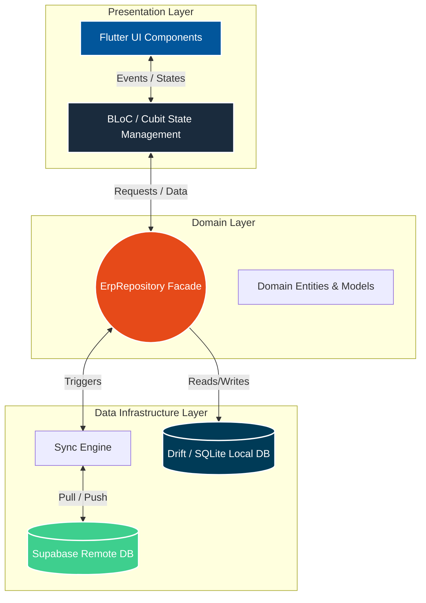

<<<<<<< HEAD

# 🏢 SakanOS | نظام إدارة وتخطيط الموارد العقارية (Real Estate ERP)

[](#)
[](#)
[](#)
[](#)
[](#)

**الجيل الجديد من أنظمة تخطيط الموارد (ERP) المخصصة لشركات التطوير العقاري، التعهدات، والمكاتب الهندسية والجمعيات السكنية.**

تم بناء نظام **SakanOS** ليُعالج أعقد المشاكل المالية في الأسواق المتقلبة، مستبدلاً جداول "الإكسل" والأنظمة التقليدية بنظام برمجي متكامل يعمل بذكاء اصطناعي حسابي، وبنية تحتية تدعم العمل بدون إنترنت (**Offline-First**) مع مزامنة سحابية لحظية ثنائية الاتجاه، ودعم كامل للغتين العربية والإنجليزية (**Multilingual**).

---

## 🧠 الفلسفة المالية والنواة الحسابية (The Core Engine)

على عكس الأنظمة العقارية التقليدية التي تعتمد على "قسط ثابت" و"تسعيرة ثابتة"، يعتمد نظام **SakanOS** على هندسة مالية مرنة تُسمى **(التسعير الديناميكي والأمتار المحولة - Dynamic Pricing & Converted Meters)** لحماية الشركة والعميل من مخاطر التضخم وهبوط العملة:

* **محرك التسعير اللحظي:** سعر المتر المربع ليس رقماً ثابتاً، بل يتم حسابه برمجياً بناءً على تقلبات أسعار المواد الأساسية في السوق لحظة الدفع (الحديد، الأسمنت، البلوك، أجور الكوفراج والصب، المواد الحصوية، وأجور العمال).
* **شراء الأمتار (Converted Meters):** عندما يقوم العميل بتسديد دفعة، يقوم النظام بقسمة (المبلغ المدفوع) على (سعر المتر المربع اليوم)، ليحسب **عدد الأمتار الفعلي التي تملكها العميل بهذه الدفعة**، وتتحول هذه الأمتار إلى ملكية حقيقية غير قابلة للتأثر بالتضخم مستقبلاً.
* **معاملات التمييز المكانية والمالية (Coefficients):** القدرة على تخصيص سعر كل وحدة بناءً على (الموقع، الشارع، المصعد، الاتجاه، الطابق، الواجهة، الوجيبة، التراس، وهامش الربح)، مع حفظها بمرونة كبيانات **JSON** داخل قاعدة البيانات.

---

## ✨ الخصائص والوحدات الأساسية (Modules & Features)

### 📊 1. لوحة القيادة والتحليلات المباشرة (Dashboard & KPI Analytics)

* **المؤشرات المالية الحيوية (KPIs):** عرض لحظي للسيولة النقدية الصافية، الأموال المستردة، الديون الجارية (قيد الإنشاء)، الذمم المستحقة (الشقق المُسلّمة)، والمخزون المتاح.
* **المخططات البيانية التفاعلية (Interactive Charts):**
  * مخطط التدفق النقدي والتحصيل الشهري/اليومي.
  * مخطط تتبع اتجاه سعر صرف الدولار والتكلفة الإنشائية الخام.
  * توزيع محفظة العقود وجرد الشقق والمحلات التجارية.
  * ميزان حركة الأمتار المربعة (الأمتار المخصصة المسددة vs أمتار المحافظ الاستثمارية).
* **سجل النشاطات الحديثة (Audit Activity Log):** تتبع جميع الحركات والتعديلات المسجلة من قبل الموظفين لحظة بلحظة.

---

### 🏢 2. كتالوج المشاريع والوحدات العقارية (Properties & Catalog)

* **دعم كلاً من الشقق والمحلات التجارية (Apartments & Commercial Shops):**
  * حسابات هندسية مخصصة للمحلات بناءً على (مساحة الأرضي، عرض الواجهة، مساحة التراس، والوجيبة).
* **استنساخ الطوابق (Floor Cloning):** إمكانية استنساخ نموذج طابق بالكامل لشقق أخرى بنقرة زر مع تعديل الأرقام تلقائياً لتوفير وقت الإدخال.
* **معرض المرفقات والمخططات:** إمكانية إرفاق الصور والوثائق والمخططات الهندسية لكل محضر أو شقة مع استعراضها داخل التطبيق.

---

### 📄 3. إدارة العقود والمحافظ الاستثمارية (Contracts & Portfolios)

* **دعم نوعين أساسيين من العقود:**
  1. **عقود متخصصة (Allocated):** شقق/محلات محددة برقم وموقع وطابق معين، وتدعم الشروط الجزائية وفترات السماح للمطور.
  2. **عقود لاحقة التخصص / محفظة استثمارية (Unallocated Shares):** شراء أسهم وأمتار مجردة يتم تخصيص شقة لها مستقبلاً بناءً على رصيد الأمتار المتراكم.
* **دعم العقود القديمة (التاريخية):** إمكانية إدخال عقود بتاريخ قديم وتحديد أسعار المواد والدولار الخاصة بذلك التاريخ لتطبيق الحسابات بآثر رجعي.
* **أرشفة وإغلاق العقود (Contract Archiving):** إمكانية إغلاق العقد بعد استكمال دفعه لحمايته من التعديل وسحبه من رادار التنبيهات مع الاحتفاظ بسجله المالي.

---

### 🗓️ 4. برج المراقبة والرادار الذكي (Smart Radars & Overdue Engine)

* **رادار المتعثرين (Overdue Radar):** تصنيف التخلف عن السداد حسب شدة الخطورة (Notice / Warning / Critical) بترميز لوني واضح بناءً على عدد أيام التأخير، مع إمكانية إرسال مطالبتها عبر WhatsApp مباشرة.
* **رادار التخصص والوصول للهدف (Allocation Radar):**
  * مراقبة سرعة شراء العميل للأمتار ($m^2 / month$) وتوقع الأشهر المتبقية لتخصيص شقة له.
  * تصنيف حالات الاقتراب من الهدف (حرجة، متوسطة، آمنة).
  * **ذاكرة الإجراءات الإدارية:** إمكانية تسجيل ملاحظة إدارية على العقد لإخفاء التنبيه مؤقتاً وتجنب إزعاج العملاء.

---

### 💰 5. قيود الدفع ودفتر الأستاذ (Payments Ledger)

* **إيداع وسحب مرن:** دعم القبض بالعملة المحلية (SYP) أو بالدولار (USD) مع التحويل الآلي وفق سعر الصرف.
* **دعم البونص والخصومات:** إمكانية منح بونص مئوي على الدفعة أو اقتطاع رسوم.
* **التسوية المحاسبية والقيود العكسية (Reverse Entries):**
  * إبطال الإيصال فوراً خلال فترة سماح المطور (5 دقائق).
  * إنشاء قيد عكسي بسند استرداد نقدي سالب بعد انقضاء الـ 5 دقائق لحفظ نزاهة التدقيق المحاسبي.

---

### ⚖️ 6. أرشيف الشؤون القانونية (Legal Affairs)

* **تتبع الإجراءات القانونية:** تسجيل الإنذارات، الفراغ العقاري، الرهن، التسويات، والدعاوى القضائية المرتبطة بكل عقد.
* **معرض المرفقات والوثائق القضائية:** رفع واستعراض صور المحاضر والوثائق القانونية وربطها بالإجراء.

---

### 🗑️ 7. سلة المحذوفات الشاملة (Global Recycle Bin)

* **الحذف المؤقت (Soft Delete):** نقل العملاء، العقود، المحاضر، الشقق، والإيصالات المحذوفة إلى السلة بدلاً من مسحها فوراً.
* **التنظيف الآلي (Auto-Clean):** حذف البيانات الموجودة في السلة آلياً بعد مرور 7 أيام.
* **الحذف النهائي والتدمير (Hard Delete):** يتطلب إدخال رمز الأمان (Security PIN) لحذف العنصر نهائياً.

---

### 🔐 8. نظام الأمان، الصلاحيات، وحماية الوقت (Security & Governance)

* **إدارة الصلاحيات القائمة على الأدوار (RBAC):** تحديد صلاحيات دقيقة جداً لكل موظف (عرض، إضافة، تعديل، حذف، الشؤون القانونية، سلة المحذوفات).
* **رمز الأمان (Security PIN):** حماية التعديلات الحساسة والحذف والإلغاء برمز PIN خاص مع **جلسة آمنة تنتهي تلقائياً بعد 5 دقائق**.
* **محرك الوقت الآمن (SecureTime & Clock Anti-Tampering):**
  * حساب الفجوة الزمنية (Time Drift Offset) بين جهاز المستخدم والسيرفر للحد من محاولات التلاعب بساعة الجهاز لتزوير التواريخ.
  * قفل النظام تلقائياً في حال تجاوز العمل بدون إنترنت مهلة الـ **7 أيام**.

---

### 🖨️ 9. التقارير، طباعة الـ PDF، والـ WhatsApp

* **طباعة الفواتير والإيصالات (PDF Generator):**
  * إيصالات قبض وسندات استرداد متوافقة مع القياسات المعتمدة، مقسومة لنسختين (نسخة المكتب / نسخة العميل).
  * كشوفات حساب شاملة ومفصلة للعقود المتخصصة وغير المتخصصة.
  * محضر استلام مبدئي وتعهد بالتجهيزات المشتركة عند تسليم الشقة.
  * التفقيط الآلي للمبالغ المالية باللغة العربية (**Arabic Tafqeet**).
* **تصدير البيانات لـ Excel:** تصدير كشوفات الحساب بضغطة زر إلى ملفات `.xlsx`.
* **تكامل WhatsApp:** إرسال فواتير القبض وتذكيرات الأقساط المتأخرة بنقرة زر واحدة عبر رابط المراسلة المباشر.
=======
<div align="center">
  
  
  # SakanOS 🏢
  **Enterprise-Grade, Offline-First Real Estate ERP**
  
  [](https://flutter.dev)
  [](https://dart.dev)
  [](https://supabase.com)
  [](https://drift.simonbinder.eu/)
  [](https://bloclibrary.dev/)
</div>

---

## 📑 Executive Summary
Real estate development companies operating in volatile markets face severe operational bottlenecks: unstable internet connectivity, severe currency/material inflation, and complex, error-prone manual installment tracking. 

**SakanOS** is a localized, offline-first Enterprise Resource Planning (ERP) system engineered to solve these exact challenges. Built with Flutter for cross-platform desktop/mobile deployment, SakanOS digitizes the entire real estate lifecycle—from inventory and client management to dynamic, material-pegged financial contracts and legal archiving. The system guarantees **0% downtime** by prioritizing local SQLite reads/writes, silently syncing with a Supabase cloud backend the moment network connectivity is restored.

---

## 📈 Impact Metrics (Manual vs. SakanOS)

| Workflow / Metric | Traditional Manual Process | SakanOS Automated Workflow | Impact |
| :--- | :--- | :--- | :--- |
| **Contract Generation & Pricing** | ~45 minutes (Manual calculation) | **< 15 seconds** (Auto-calculated) | **99% faster** |
| **Offline Reliability** | Standstill during outages | **100% Operational** | **Zero Downtime** |
| **Late Penalty Tracking** | Prone to human error / manipulation | **Fully Automated & Tamper-Proof** | **Zero Revenue Leakage** |
| **Data Synchronization** | Manual data entry at EOD | **Background Bi-Directional Sync** | **Real-time Accuracy** |
| **Ledger / Receipts Output** | Manual Word/Excel typing | **Instant PDF Generation & WhatsApp** | **Instant Delivery** |
>>>>>>> 3126133ee489a6ba7a441c71b53d87ef572a315c

---

## 🏗️ Clean Architecture & Data Flow

<<<<<<< HEAD


┌───────────────────────────────────┐
                       │     SakanOS Flutter Desktop UI     │
                       └─────────────────┬─────────────────┘
                                         │
                        ┌────────────────┴────────────────┐
                        │   BLoC / Cubit State Engine     │
                        └────────────────┬────────────────┘
                                         │
                     ┌───────────────────┴───────────────────┐
                     │         ErpRepository Facade          │
                     └─────────┬───────────────────┬─────────┘
                               │                   │
                               ▼                   ▼
                     ┌──────────────────┐ ┌──────────────────┐
                     │ LocalStorageApi  │ │ CloudStorageApi  │
                     │  (Drift / SQLite)│ │ (Supabase Client)│
                     └──────────────────┘ └────────┬─────────┘
                                                   │
                                                   ▼
                                         ┌──────────────────┐
                                         │ Supabase Cloud   │
                                         │  (PostgreSQL)    │
                                         └──────────────────┘
معمارية العمل بدون إنترنت (Offline-First):
الواجهة تتعامل مباشرة مع قاعدة بيانات Drift (SQLite) على الجهاز المحلي لسرعة أداء فائقة وموثوقية أثناء انقطاع الشبكة.
استخدام المعرفات الفريدة UUID v7 (المرتبة زمنياً) لمنع حدوث أي تضارب (Collisions) عند المزامنة بين أجهزة متعددة.
محرك المزامنة الخلفي (Ghost Background Sync):
رفع التعديلات (Push): رفع البيانات المحلية غير المتزامنة تتابعياً للسحابة مع حماية ضد مسح البيانات.
سحب التحديثات (Pull): استيراد البيانات الجديدة المقسمة لحزم (Pagination chunks of 1000) لضمان أداء مستقر ومستمر دون تجميد الواجهة.
معمارية موزع الشركات (Tenant Router Multi-Tenancy Architecture):
دعم الفصل التام لبيانات العملاء والشركات العقارية في قواعد بيانات سحابية مستقلة لرفع معايير الخصوصية والأمان.
👨‍💻 التقنيات والمكتبات المعتمدة (Tech Stack)
الواجهة والمنصة: Dart / Flutter (مخصص لأنظمة Windows Desktop, macOS, Android).
إدارة الحالة (State Management): flutter_bloc / cubit + equatable.
قاعدة البيانات المحلية: drift (SQLite Native) للسرعة والموثوقية المطلقة.
قاعدة البيانات السحابية والمصادقة: supabase_flutter (PostgreSQL + Auth + Storage).
التقارير والطباعة: pdf, printing, excel.
الرسوم البيانية: fl_chart.
التدويل واللغات (i18n): flutter_localizations (ملفات ARB: app_ar.arb, app_en.arb).
إدارة المتغيرات والمفاتيح: envied للتشفير والتعمية الآمنة لمفاتيح الربط السحابية.
التواصل الخارجي: url_launcher لتوجيه رسائل WhatsApp والتفاعل مع الملفات.
🚀 طريقة التشغيل والإعداد (Getting Started)

1. المتطلبات الأساسية
   بيئة Flutter SDK (الإصدار 3.11+ أو أحدث).
   بيئة تطوير مفضلة (VS Code أو Android Studio).
2. تثبيت الحزم وتوليد الأكواد
   code
   Bash

# 1. استคลون المستودع
=======
SakanOS strictly adheres to Clean Architecture principles, utilizing the Repository Pattern as a Facade to abstract data source complexity from the UI/BLoC layers.


>>>>>>> 3126133ee489a6ba7a441c71b53d87ef572a315c

git clone https://github.com/your-org/sakanos-erp.git
cd sakanos-erp

<<<<<<< HEAD
# 2. تثبيت الاعتمادات والحزم

flutter pub get
=======
## 🚀 Engineering Highlights

### 1. Offline-First Bi-Directional Sync Engine
SakanOS is designed to never block the user. All reads and writes occur instantly on the local SQLite database (`Drift`). 
* **Conflict-Free Pushing:** A background `SyncRepository` handles batched upserts to Supabase based on an `is_synced` flag.
* **Paginated Pulling:** To bypass payload limits, the system safely pulls remote data in chunks of 1,000 records (`_fetchAllPaginated`), cross-referencing `updated_at` UTC timestamps to avoid overwriting local changes.
* **Realtime Listeners:** Utilizes Supabase Postgres changes to push live pricing updates across all active nodes automatically.

### 2. SecureTime™ Anti-Tamper Engine
Because contracts involve severe financial delay penalties, client devices cannot be trusted. If an employee alters the OS clock to bypass late fees, SakanOS detects it.
* Pings secure external headers (e.g., `google.com`) to calculate a true `Duration offset`.
* Stores the offset via encrypted XOR base64 locally (`sys_time_drift_offset`).
* Overrides `DateTime.now()` system-wide, ensuring all financial calculations and contract signatures are cryptographically tied to actual network time.

### 3. Atomic ACID Transactions
Financial integrity is paramount. Operations like signing a contract involve multiple database mutations (Creating the Contract, logging the Down Payment, locking the Apartment Inventory, creating the Installment Schedule).
* Utilizing Drift's `transaction()` blocks, SakanOS guarantees **Atomicity**.
* Example: If the initial payment logging fails, the contract creation and inventory locks are instantly rolled back, preventing orphaned data or double-booked real estate units.

### 4. Advanced Role-Based Access Control (RBAC) & Grace Periods
* **Granular Permissions:** JSON-driven custom roles controlling everything from viewing clients to hard-deleting legal archives.
* **Action Grace Periods:** Critical actions (like deleting a payment) have a 5-minute "Developer Grace Period" for soft-deletes. After 5 minutes, records are locked, forcing users to utilize standard **Double-Entry Accounting** (creating a reverse refund entry) to ensure audit compliance.
>>>>>>> 3126133ee489a6ba7a441c71b53d87ef572a315c

# 3. إعداد ملف البيئة (.env) في الجذر الرئيسي للمشروع

<<<<<<< HEAD
echo "SUPABASE_URL=https://your-supabase-url.supabase.co" > .env
echo "SUPABASE_ANON_KEY=your-supabase-anon-key" >> .env

# 4. تشغيل مولد الأكواد (Drift / Envied / L10n)

dart run build_runner build --delete-conflicting-outputs
3. أوامر التشغيل حسب البيئة (Launch Configurations)
يمتلك المشروع 3 بيئات تشغيلية معزولة ومستقلة:
code
Bash

# بيئة التطوير (Development)

flutter run -t lib/main_development.dart

# بيئة الاختبار (Staging)

flutter run -t lib/main_staging.dart

# بيئة الإنتاج (Production)

flutter run -t lib/main_production.dart
نظام SakanOS ليس مجرد برنامج محاسبي، بل هو نواتك الاستراتيجية نحو التحول الرقمي وإدارة الاستثمارات العقارية بأسلوب رياضي وبرمجي متين.
=======
## 🧩 Core Modules

* **🏢 Inventory Catalog:** Manage Buildings, Apartments, and Commercial Shops with complex architectural pricing coefficients (Floor, Direction, Facades).
* **📝 Dynamic Contracts:** Support for both *Allocated* (specific property) and *Unallocated* (Investment Portfolio shares) contracts.
* **💳 Financial Ledger:** Track installments, issue PDF receipts, calculate dynamic material-pegged meter prices, and integrate with WhatsApp for automated billing reminders.
* **⚖️ Legal Affairs:** A dedicated module for tracking lawsuits, warnings, mortgages, and secure cloud storage of legal PDF/Image attachments.
* **📊 Analytics Dashboard:** Rich KPI tracking, interactive charts (via `fl_chart`), and real-time cash flow and construction cost trending.

---

## 🛠️ Tech Stack

* **Framework:** Flutter (Desktop / Web / Mobile)
* **Language:** Dart 3.11+
* **State Management:** `flutter_bloc`, `equatable`
* **Local Database:** `drift` (SQLite), `sqlite3_flutter_libs`
* **Remote Backend:** `supabase_flutter` (PostgreSQL, Auth, Storage)
* **Reporting & Export:** `pdf`, `printing`, `excel`
* **Localization:** Standard Flutter ARB (Fully localized English/Arabic UI)

---

## 🏁 Getting Started

### Prerequisites
* [Flutter SDK](https://docs.flutter.dev/get-started/install) (v3.41.0 or higher)
* A [Supabase](https://supabase.com/) Project (Database, Auth, and Storage buckets created).

### 1. Environment Setup
Create a `.env` file in the root directory and populate it with your Supabase credentials. The `envied` package will obfuscate these during build time.
```env
SUPABASE_URL=https://your-project-id.supabase.co
SUPABASE_ANON_KEY=your-anon-key-here
```

### 2. Install Dependencies
```bash
flutter pub get
```

### 3. Code Generation (Drift & Envied)
SakanOS relies heavily on code generation for local DB schemas and environment variables.
```bash
dart run build_runner build --delete-conflicting-outputs
```

### 4. Run the Application
For the best experience, run SakanOS as a Desktop application (Windows/macOS/Linux):
```bash
flutter run -d windows
# or
flutter run -d macos
```

---

<div align="center">
  <i>Designed & Engineered with ❤️ for the Modern Real Estate Market.</i><br>
  <b>Candidate Portfolio - Google STEP Program</b>
</div>
>>>>>>> 3126133ee489a6ba7a441c71b53d87ef572a315c
